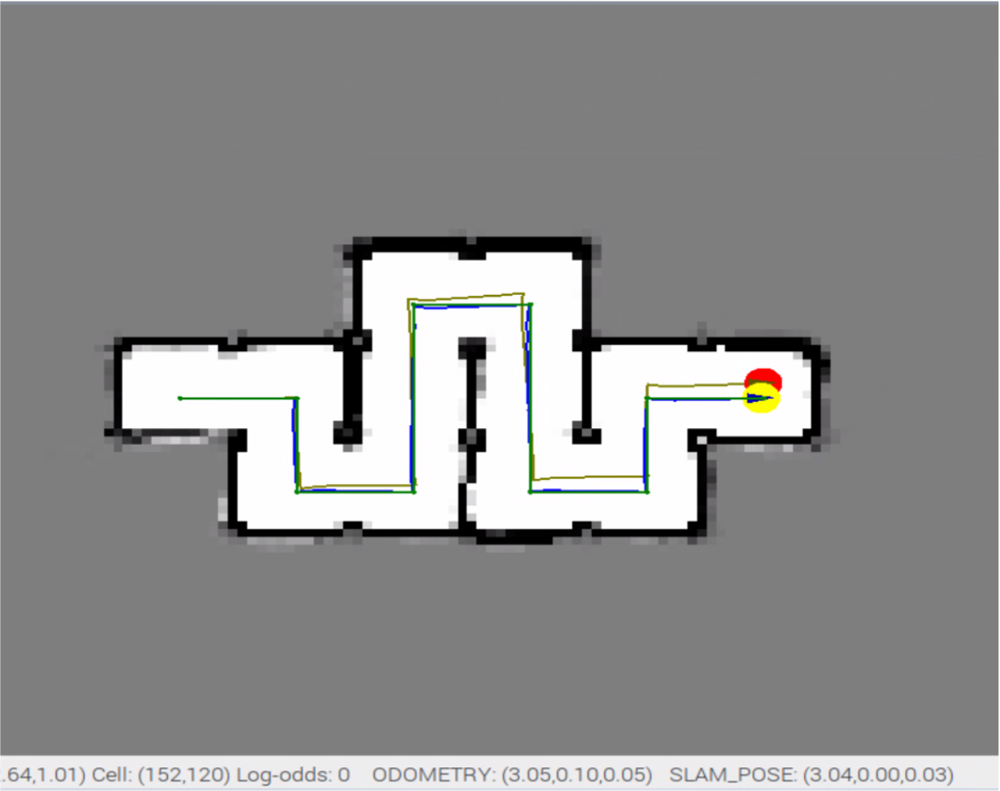

In this project, a differential-drive mobile robot "MBot" is assembled. A motion controller is designed by incorporating odometry readings in order to drive the MBot through different desired positions. To minimize the effects of error propagation on odometry readings, the motion controller in conjunction with a SLAM algorithm provides a more accurate localization of the robot. Using this understanding of the environment, an A* path planning algorithm is programmed to enable the MBot to autonomously navigate.

Robot assembly:

Mapping:

SLAM:




Exploration:
